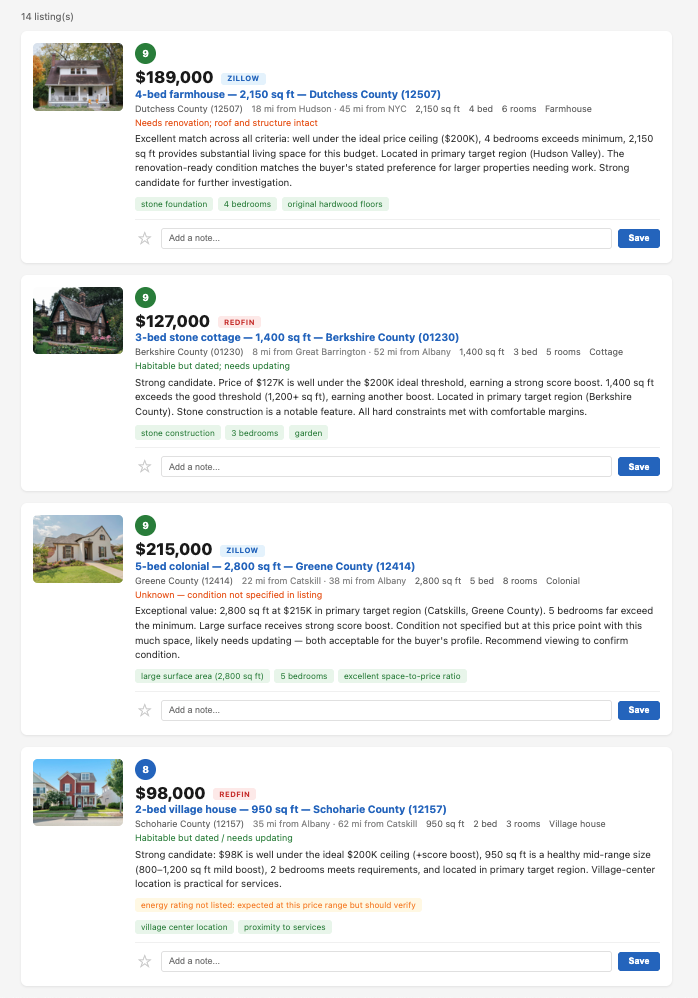

# listing-monitor

Real estate listing sites send dozens of alert emails a day, most of them irrelevant: wrong price, wrong area, wrong type. Scanning them manually takes 20 minutes every day, and most of it is wasted on listings that don't match.

This agent automates that process. It reads listing alert emails, extracts every property, scores each one against a configurable profile using an LLM (Anthropic Haiku), and stores the results in a local database. A dashboard shows only the listings that scored above your threshold, sorted by relevance, with the model's reasoning for each score. It runs as a daily cron job and the API costs are negligible (see [Cost](#cost)).

## What it does, end to end

Every morning at 7 AM the agent:

1. Connects to Gmail and pulls new listing alert emails from all subscribed sources
2. Parses the HTML of each email to extract structured property data (price, size, location, type, photos)
3. Rejects obvious mismatches locally using hard constraints from the profile (never wastes an API call on a studio apartment when you want 3 bedrooms)
4. Sends the remaining candidates to an LLM for nuanced scoring: Does this location actually match? Is the price good for the size? Is the condition acceptable? Are there red flags in the description?
5. Stores everything in a database, deduplicates across sources, and geocodes each property to calculate distance to reference cities and coast
6. Serves a dashboard where you filter, star, and annotate listings at your own pace

No manual step between "email arrives" and "scored listing appears on dashboard." 

## How it works

```
Gmail inbox                    Profile config
     │                              │
     ▼                              │
 Fetch emails (Gmail API)           │
     │                              │
     ▼                              │
 Parse HTML → extract listings      │
     │                              │
     ▼                              │
 Pre-filter (hard constraints) ◄────┤
     │                              │
     │  (rejects never hit the API) │
     ▼                              │
 Score with Anthropic Haiku ◄───────┘
     │
     ▼
 SQLite database
     │
     ▼
 Local dashboard (FastAPI)
```

1. **Fetch**: Pulls listing alert emails from Gmail using the API. Tracks processed message IDs to avoid re-reading.
2. **Parse**: Each email source has its own HTML parser (BeautifulSoup). Extracts price, type, surface, location, rooms, photos, listing URL.
3. **Pre-filter**: Hard constraints (price ceiling, minimum size, rejected types) are checked locally. Listings that fail never touch the API. Saves money.
4. **Score**: Surviving listings go to Anthropic Haiku with the full scoring profile. Returns a 0-10 score, reasoning, flags, and feature observations.
5. **Store**: Everything goes into SQLite: listings, scores, stars, notes.
6. **Dashboard**: FastAPI serves a single-page app at `localhost:8501`. Filter by score, price, date, region. Star listings, add notes.

## Dashboard



## What a score looks like

The scorer returns structured JSON for each listing:

```json
{
  "score": 9,
  "hard_constraint_pass": true,
  "hard_constraint_failures": [],
  "flags": [{"flag": "roof_age_unknown", "note": "listing does not mention roof replacement date"}],
  "notable_features": ["hardwood floors", "detached garage", "0.5 acre lot"],
  "reasoning": "Strong price-to-size ratio in target region. 3 bedrooms, 1,400 sq ft at $127K is well under budget ceiling. Needs updating but structurally sound.",
  "condition_estimate": "habitable but dated"
}
```

## Setup

### 1. Gmail API credentials

1. Go to [Google Cloud Console](https://console.cloud.google.com/) → APIs & Services → Enable the **Gmail API**
2. Create an **OAuth 2.0 Client ID** (Desktop app)
3. Download the JSON → save as `gmail/credentials.json`
4. First run opens a browser for OAuth consent. After that, the token is saved to `gmail/token.json`

### 2. Anthropic API key

```bash
export ANTHROPIC_API_KEY=sk-ant-...
```

Or add it to your shell profile so it's available every time you open a terminal.

### 3. Install dependencies

```bash
uv venv venv
source venv/bin/activate
uv pip install -r requirements.txt
```

### 4. Create your scoring profile

Copy the sample and adapt it to your use case:

```bash
cp config/sample-profile.json config/your-profile.json
```

The profile defines hard constraints (instant rejects), scoring tiers, target regions, accepted/rejected types, flags that need human review, and features to observe. See `config/sample-profile.json` for the full structure. The sample profile demonstrates the scoring system with a rural property search in upstate New York.

### 5. Write a parser for your email source

Each listing site sends different HTML. You need one parser per source. See `parsers/example_listing_site.py` for the pattern:

- Find listing blocks in the HTML (comment markers or repeated DOM structures)
- Extract fields using BeautifulSoup (anchor `name` attributes, CSS classes, etc.)
- Return a list of dicts matching the database schema

Test standalone:
```bash
python gmail/fetch_emails.py --dump          # Save a sample email
python parsers/your_parser.py                # Test against it
```

### 6. Run it

```bash
python run.py                # Normal run (last 24 hours)
python dashboard.py          # Start the dashboard
```

## Flags

| Flag | What it does |
|---|---|
| `--days N` | Fetch emails from last N days (default: 1) |
| `--dry-run` | Everything except API scoring. No cost. |
| `--rescore` | Delete all scores, re-score every listing. Use after profile changes. |
| `--dedup` | Remove duplicate listings and exit |

## Standalone scripts

```bash
python gmail/fetch_emails.py                      # List recent alert emails
python gmail/fetch_emails.py --dump               # Save most recent email HTML
python gmail/fetch_emails.py --dump-from <source> # Save most recent from a specific sender
python parsers/example_listing_site.py            # Test parser against sample
python scorer/score.py --test                     # Score a hardcoded sample listing
python dashboard.py                               # Dashboard at localhost:8501
```

## Cost

Each listing costs roughly $0.01 to $0.02 to score with the full profile and listing data in the prompt. Pre-filtering rejects obvious mismatches before they hit the API, so you only pay for plausible candidates. Expect $2-5/month in API costs depending on volume. The tool itself runs on any always-on machine or VPS you already have.

## Stack

- Python 3.12
- Gmail API (google-api-python-client)
- BeautifulSoup + lxml (HTML parsing)
- Anthropic SDK + Haiku (scoring)
- SQLite (storage)
- FastAPI + uvicorn (dashboard)
- Nominatim/OpenStreetMap (geocoding)